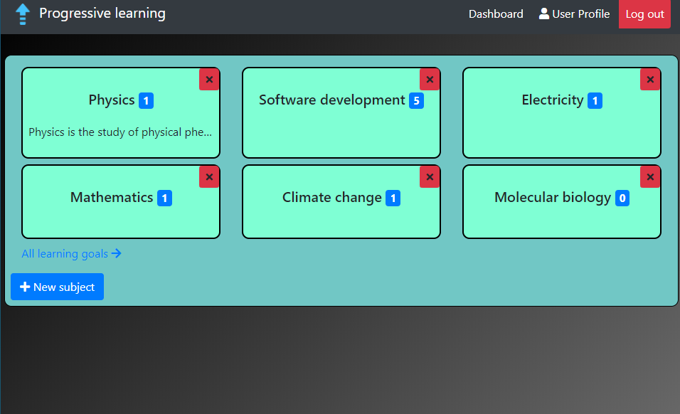
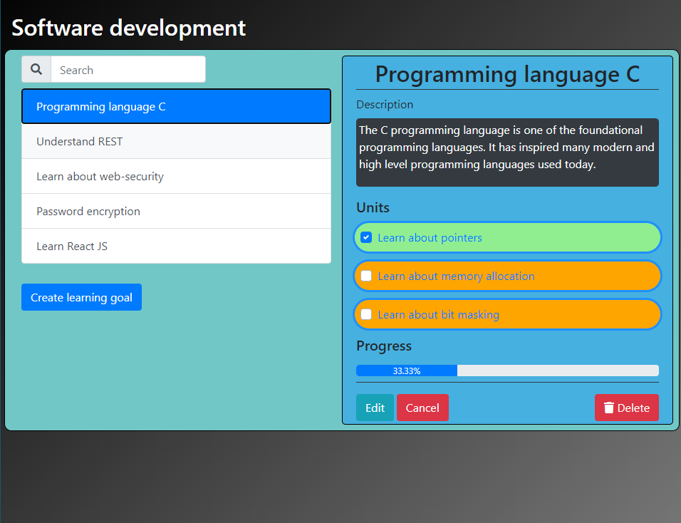
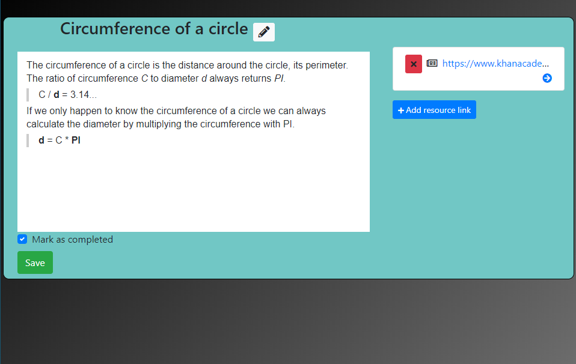
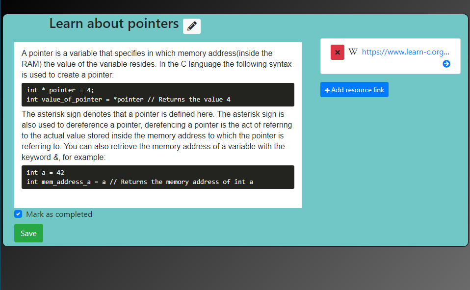

# Progressive learning webapplication

Progressive learning is a general purpose knowledge management system.
The main features of the app are: 
* Enable users to create learning-goals and categorize them.
* Users can store and manage their resource URL's in a central place instead of constantly looking them up.

The app is developed using the SEAN(Sequelize, Express, Angular, Node) stack
and with MYSQL as the database. It consists of a server and front-end module
which are run separately. **NOTE**: This project is still in its initial stages and under development**.

## Features

* Create learning-goals and add tasks that are part of the learning-goal.
* Add resource URL's/links related to a task.
* Write summaries about a task and the related material.
* Keep track of progress by completing tasks.
* Organize learning-goals into subjects.

## Usage

The recommended way to run the application(for now) is to build it but there is also
an online version of the app online at this url: https://progressive-learning.netlify.app/.
**NOTE**: The online version is only intended for testing and demo purposes, there are 
frequent data-wipes and it's unstable.

In order to build the app yourself follow these steps: 

1. Clone the repository. 
2. Add a `.env` file and configure the following environment variables: 
    * `DB_USER`, `DB_PASS`, `PORT`, `JWT_SECRET`, `JWT_EXPIRATION`, `COOKIE_SECRET`
3. By default the `sqlite` database is used, `mysql` or `postgresql` is recommended to persist data.        
4. Navigate to the `server` folder and enter the following command: `node start`.
5. Navigate to the `front-end` folder and enter the following command: 
``ng serve``.
6. Navigate in your browser to the following URL: `localhost:4200`.
7. The app is now ready for use.

## Screenshots

Dashboard:

Learning-goal examples:
  

  

Task summary examples: 

    
## Contribution

Besides the fact that I needed a tool like this, I started this project also to learn more about Node and express.
I encourage pull requests and feel free to correct me on mistakes that I've made in the code. 
Make sure to follow the git commit message conventions.

